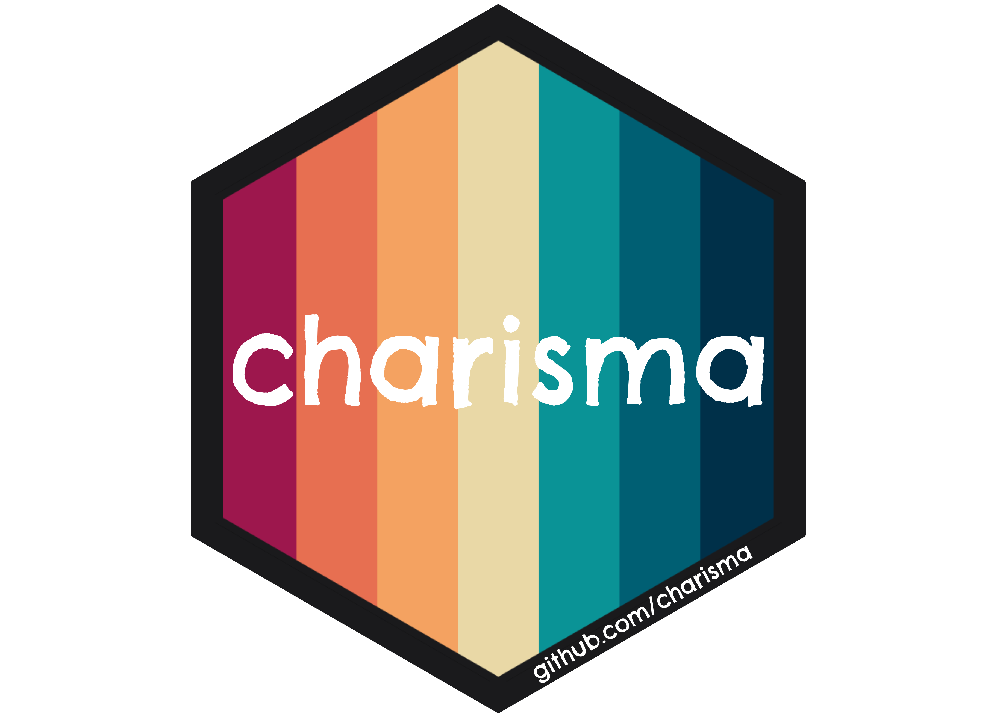
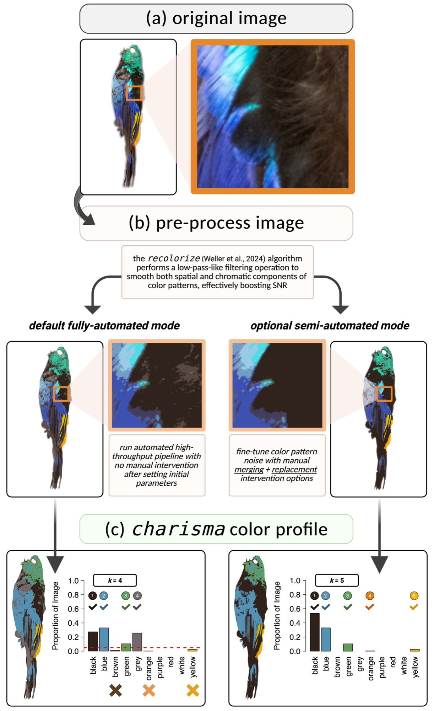
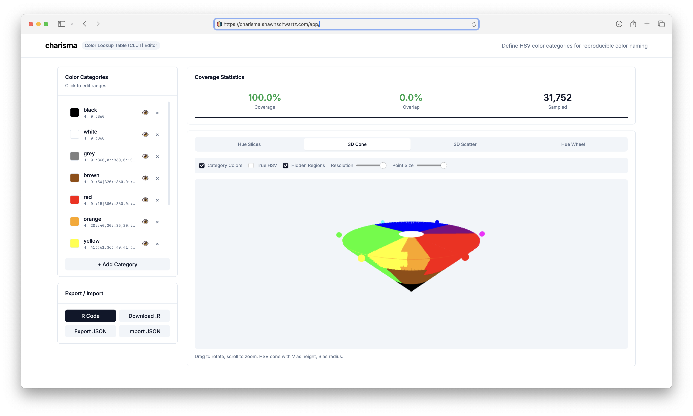

<!-- README.md is generated from README.Rmd. Please edit that file -->

```{r, include = FALSE}
knitr::opts_chunk$set(
  collapse = TRUE,
  comment = "#>",
  fig.path = "man/figures/README-",
  out.width = "100%"
)
```

# charisma 

<!-- badges: start -->
[](https://CRAN.R-project.org/package=charisma)
[](https://cran.r-project.org/package=badger)
[](https://lifecycle.r-lib.org/articles/stages.html#stable)
[](https://github.com/shawntz/charisma/actions/workflows/R-CMD-check-build.yml)
[](https://github.com/shawntz/charisma/actions/workflows/air-format-check.yml)
[](https://github.com/shawntz/charisma/actions/workflows/air-format-suggest.yml)
[](https://github.com/shawntz/charisma/actions/workflows/spellcheck.yml)
[](https://github.com/shawntz/charisma/actions/workflows/pkgdown.yml)
<!-- badges: end -->


> **charisma** provides a standardized, reproducible framework for characterizing discrete color classes in digital images of biological organisms.

## Overview

`charisma` automatically classifies colors in images into 10 human-visible categories using a biologically-inspired Color Look-Up Table (CLUT):

**Black** · **Blue** · **Brown** · **Green** · **Grey** · **Orange** · **Purple** · **Red** · **White** · **Yellow**

### Key Features

✨ **Fully Reproducible**: Complete provenance tracking of all operations

🎨 **10 Color Classes**: Biologically-relevant discrete color categories

🔧 **Flexible Workflows**: From fully automated to completely manual

📊 **Evolutionary Integration**: Seamless compatibility with `geiger`, `phytools`, `pavo`

⚡ **High-Throughput**: Designed for analyzing large image datasets

🔍 **Validated CLUT**: Non-overlapping HSV color space partitions

## Installation

### System Dependencies

`charisma` depends on spatial R packages that require system-level libraries. Install these first:

**macOS (via Homebrew):**
```bash
brew install udunits gdal proj geos
```

**Ubuntu/Debian:**
```bash
sudo apt-get install libudunits2-dev libgdal-dev libgeos-dev libproj-dev
```

**Fedora/RedHat:**
```bash
sudo dnf install udunits2-devel gdal-devel geos-devel proj-devel
```

### Stable Version (CRAN)

```{r, eval = FALSE}
install.packages("charisma")
```

### Development Version (GitHub)

```{r, eval = FALSE}
# install.packages("remotes")
remotes::install_github("shawntz/charisma")
```

## Quick Start

```{r, eval = FALSE}
library(charisma)

# Load example image
img <- system.file(
  "extdata", 
  "Tangara_fastuosa_LACM60421.png",
  package = "charisma"
)

# Basic analysis
result <- charisma(img, threshold = 0.05)

# Visualize
plot(result)

# Interactive mode with manual curation
result_interactive <- charisma(
  img,
  interactive = TRUE,
  threshold = 0.0
)

# Save outputs
result_saved <- charisma(
  img,
  threshold = 0.05,
  logdir = file.path(tempdir(), "charisma_outputs")
)
```

## How It Works

The `charisma` pipeline consists of three stages:

### 1. Image Preprocessing

Uses [`recolorize`](https://github.com/hiweller/recolorize) to perform spatial-color binning, removing noisy pixels and creating a smoothed representation of dominant colors.

### 2. Color Classification

Converts RGB cluster centers to HSV and matches against the CLUT using `color2label()`:

```{r, eval = FALSE}
color2label(c(255, 0, 0))    # "red"
color2label(c(0, 0, 255))    # "blue"
color2label(c(255, 255, 0))  # "yellow"
```

### 3. Optional Manual Curation

In interactive mode:

- **Merge** color clusters (e.g., `c(2,3)`)
- **Replace** pixels between clusters
- Full operation history maintained for reproducibility

---

The `charisma` object contains:

- **Color classifications**: Discrete labels for each cluster
- **Proportions**: Pixel counts and proportions per color
- **Operation history**: Complete log of merges and replacements
- **Pavo statistics**: Color pattern geometry metrics (optional)

---

## Example Workflows

```{r, echo = FALSE, eval = TRUE}

```

## Advanced Features

### Re-analyze Saved Objects

```{r, eval = FALSE}
# Load previous analysis
obj <- system.file("extdata", "Tangara_fastuosa.RDS", package = "charisma")
obj <- readRDS(obj)

# Apply different threshold
result2 <- charisma2(
  obj, 
  new.threshold = 0.10
)

# Revert to specific state
result3 <- charisma2(
  obj, 
  which.state = "merge", 
  state.index = 2
)
```

### Custom Color Look-Up Tables

Create and customize CLUTs using the interactive [CLUT Editor](https://charisma.shawnschwartz.com/app):

```{r, eval = FALSE}
# Launch the CLUT Editor in your browser
launch_clut_editor()

# Or use the local version bundled with the package
launch_clut_editor(online = FALSE)
```

<!-- TODO: Add screenshot of CLUT Editor interface -->
<!--  -->

The CLUT Editor provides:

- Visual editing of HSV color space boundaries
- Real-time coverage statistics (gaps and overlaps)
- Multiple visualization modes: hue slices, 3D cone, 3D scatter, hue wheel
- Export to R code or JSON

<!-- TODO: Add screenshot of CLUT Editor 3D visualization -->
<!--  -->

After designing your CLUT, validate and use it:

```{r, eval = FALSE}
# Create custom CLUT
my_clut <- charisma::clut  # Start with default
# ... modify HSV ranges ...

# Validate completeness
validate(clut = my_clut)

# Use in analysis
result <- charisma(img, clut = my_clut)
```

### Evolutionary Analyses

```{r, eval = FALSE}
# Batch process images
results <- lapply(image_paths, function(img) {
  charisma(img, threshold = 0.05)
})

# Extract color presence/absence
color_matrix <- do.call(rbind, lapply(results, summarize))

# Phylogenetic analyses with geiger
library(geiger)

fit_er <- fitDiscrete(
  phylogeny, 
  color_matrix[, "blue"], 
  model = "ER"
)

fit_ard <- fitDiscrete(
  phylogeny, 
  color_matrix[, "blue"], 
  model = "ARD"
)
```

## Citation

If you use `charisma` in your research, please cite:

> Schwartz, S.T., Tsai, W.L.E., Karan, E.A., Juhn, M.S., Shultz, A.J., McCormack, J.E., Smith, T.B., and Alfaro, M.E. (2025). charisma: An R package to perform reproducible color characterization of digital images for biological studies. (In Review).

## Getting Help

📖 [Documentation](https://shawnschwartz.com/charisma/)

🐛 [Report Issues](https://github.com/shawntz/charisma/issues)

📧 Email: shawn.t.schwartz@gmail.com

## Acknowledgments

`charisma` integrates with:

- [`recolorize`](https://cran.r-project.org/package=recolorize) ([Weller et al. 2024](https://doi.org/10.1111/ele.14378)) - Image preprocessing
- [`pavo`](https://cran.r-project.org/package=pavo) ([Maia et al. 2019](https://doi.org/10.1111/2041-210X.13174)) - Color pattern geometry

## License

MIT © 2025 Shawn T. Schwartz
