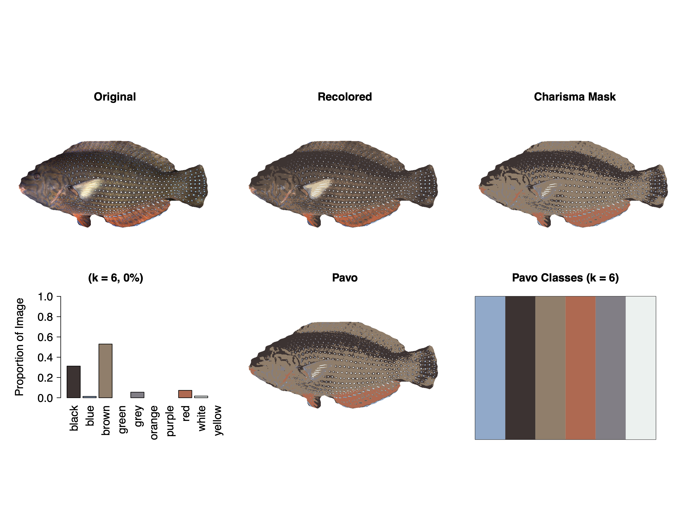
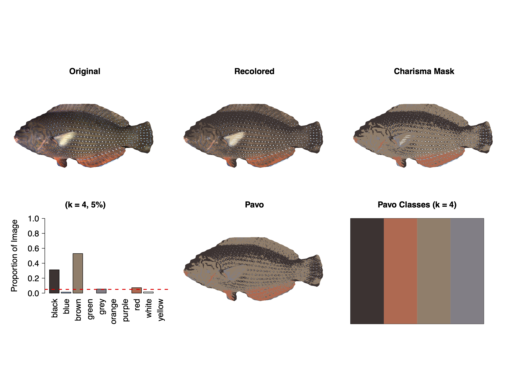

# charisma: an R package to analyze color pattern diversity at massive scale

> [!WARNING]  
> This package is still under critical development and validation. Please use and interpret results with caution.

# Installing Package

``` r
# install devtools
install.packages("devtools")

# install charisma from GitHub
remotes::install_github("shawntschwartz/charisma")
``` 

# Help

> [!IMPORTANT]  
> Please use the issues tab (https://github.com/shawntschwartz/charisma/issues) to file any bugs or suggestions.

# Demo Usage

> [!NOTE]  
> Apologies in advance, I have yet to write complete documentation for the core functions. -s-

Below is an example use of the primary `charisma()` function. The resulting `charisma` object returned by the `charisma()` function includes all relevant data which can be mined as needed. In addition to the discrete color category labels output by `charisma`, it also includes the outputs of color pattern geometry statistics computed with [`pavo`](https://github.com/rmaia/pavo).

⚠️ Note: including a valid path to the `logdir = ...` argument will force `charisma()` to save both a timestamped `.RDS` file (of the returned `charisma` object), as well as a timestamped `.pdf` file which contains the output of running `plot(...)` on the resulting `charisma` object. 

✅ Because each saved object is stored with all relevant data (as well as the history of any color merge/replacement operations performed during an `interactive` session), the `charisma` pipeline is fully reproducible. See the `charisma2()` function to be able to step through (and edit) any previously run `charisma` object.

## Example
```r
# load the charisma package
library(charisma)

# settings
color_prop_thresh <- 0.0 # 0 allows *any* prop of colors to be considered
use_interactive_mode <- T # interrupt each img with manual intervention

# define input/output paths
out_dir <- file.path("~", "Documents", "charisma_outputs")

# example of running an "interactive" charisma session on a single image
img <- system.file("extdata", "Anampses_caeruleopunctatus.png",
                   package = "charisma")

c_img <- charisma(img,
                  threshold = color_prop_thresh,
                  auto.drop = T,
                  interactive = use_interactive_mode,
                  plot = F,
                  logdir = out_dir)

# visualize output in the RStudio Viewer:
#  fyi -- since we set a logdir above, we've already automatically saved out
#  this same plot to that directory (so this is just to see it again in RStudio)
plot(c_img)

# modify which aspects are shown in the plot by turning `plot.all` to FALSE
#  and then turning on whatever components you'd like to show up in the plot
plot(c_img, plot.all = F, plot.original = T, plot.masked = T, plot.props = T)
```
## Charisma results (with no threshold)


## Charisma results (with a 5% threshold)


## Comments/Suggestions/Questions/Feedback
👋 Don't hesitate to reach out and chat! <shawn.t.schwartz@gmail.com>

# Appendix

## Modifying (and Validating the CLUT)

### Call
```r
> new_clut_validation_results <- charisma::validate(clut = my_new_clut)
```

### Results 

#### Passing ✅
```
Parallelizing CLUT validation with 13 cores for 3682561 HSV color coordinates...
This may take a while, feel free to go grab a latte!
Total elapsed time for parallelization: 2.98 minutes 

All HSV color coordinates classified! ==> Color LUT validation passed ✅
```

### Failing ⛔️
```
Parallelizing CLUT validation with 13 cores for 3682561 HSV color coordinates...
This may take a while, feel free to go grab a latte!
Total elapsed time for parallelization: 2.98 minutes 

Error: missing color classifications for 5,000 
HSV color coordinates ==> CLUT validation failed ⛔
See returned output for the HSV coordinates that failed.
```
